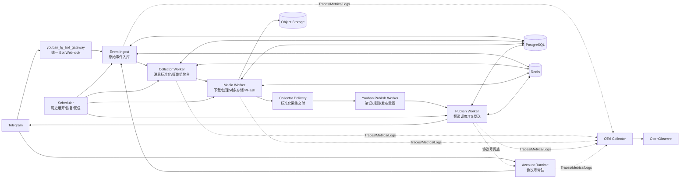

# Telegram Collector 独立插件最终架构设计

## 1. 文档目标

本文档定义将现有 `addons/youban_publish` 中 Telegram 采集相关能力剥离为独立 HotGo 插件 `addons/telegram_collector` 的最终架构。

目标不是重新实现一套 Telegram 系统，而是：

- 复制并适配当前已验证的采集、媒体、账号租约和队列能力；
- 复用 `youban_tg_bot_gateway` 的统一 Bot Webhook 和 Bot 生命周期；
- 将账号常驻、采集处理、媒体处理、资料发布完全解耦；
- 支持 Railway 多角色部署和 Worker 横向扩容；
- 通过 Redis 媒体指纹缓存减少重复下载、上传和 PHash；
- 让用户刚发起的测试采集/推送优先处理，不再被历史采集积压数小时；
- 通过 OpenTelemetry/OpenObserve 记录端到端链路，快速定位卡死、限流、重试和租约问题。

## 2. 当前问题与根因

### 2.1 职责耦合

当前采集代码集中在：

```text
addons/youban_publish/logic/sys/collect_*.go
addons/youban_publish/logic/sys/account_collect_runtime.go
addons/youban_publish/logic/sys/tg_queue_worker.go
```

这些代码同时承担：

- Telegram 账号常驻和消息监听；
- Bot 消息处理；
- 历史消息拉取；
- 事件入库；
- 媒体下载；
- 视频预览图和 PHash；
- 资料解析；
- 笔记创建；
- 发布任务生成。

导致的问题：

1. 历史采集占用处理资源，实时采集延迟很高。
2. 媒体下载、视频处理或 PHash 慢时，采集事件无法及时交付。
3. 发送任务与采集任务互相影响，历史积压会拖慢用户测试推送。
4. 普通 Worker 误消费协议号任务时，尝试创建第二个 Telegram Client，产生 `lock failed`。
5. 一个频道、账号或任务异常时，错误地影响全局队列。
6. 进程内状态和本地文件在 Railway 多副本下不可靠。
7. 缺少统一的阶段耗时、队列等待、租约、媒体命中率指标，线上排查成本很高。

### 2.2 设计原则

```text
Telegram 连接是资源，不是业务处理器。
采集、媒体处理、发布都是持久化任务，不是同步函数调用。
账号、来源、聊天、频道必须分别隔离。
Redis 是加速层，DB 和对象存储是事实来源。
优先级必须可配置，高优先级不能被历史任务阻塞。
所有任务都有 ACK、租约、超时恢复、有限重试和死信。
```

## 3. 最终服务架构



## 4. Railway 服务划分

### 4.1 API Service

启动：

```bash
/app/hotgo web
```

职责：

- 管理接口；
- 统一 Bot Gateway Webhook；
- 采集源、历史任务和发布任务配置；
- 健康检查；
- 不启动协议号 Telegram Client；
- 不执行历史拉取、媒体处理和 TG 发送。

扩容：可横向扩容。Webhook 必须通过共享队列和幂等事件入库支持多副本。

### 4.2 Collector Worker

启动：

```bash
/app/hotgo worker
```

职责：

- 消费原始 Telegram 事件；
- 消息标准化；
- 媒体组聚合；
- 来源识别和消息链接生成；
- 采集规则预处理；
- 创建媒体任务；
- 生成标准化 Delivery。

禁止：

- 创建协议号 Telegram Client；
- 直接执行历史拉取；
- 在进程内保存任务唯一状态；
- 同步等待媒体处理完成；
- 直接向 Telegram 发送消息。

扩容：可横向扩容，按来源、聊天和优先级公平消费。

### 4.3 Media Worker

建议 Railway 单独服务，启动参数使用专用角色，例如：

```bash
/app/hotgo media-worker
```

如果当前 HotGo 入口暂时只有 `web/worker/account/scheduler`，第一阶段可在 `worker` 角色内通过 `YOUBAN_WORKER_COMPONENTS=media` 启动媒体消费者；最终应拆成独立角色，避免发布 Worker 和媒体 Worker 互相抢资源。

职责：

- Bot Token 媒体下载；
- 协议号媒体任务路由；
- 图片和视频临时处理；
- 视频预览图生成；
- 对象存储上传；
- PHash/DHash 计算；
- 媒体结果缓存和索引；
- 媒体任务重试、超时恢复和死信。

扩容：可横向扩容，实例数量主要由 CPU、网络带宽、对象存储耗时和媒体队列积压决定。

### 4.4 Publish Worker

建议 Railway 单独服务，启动参数使用：

```bash
/app/hotgo publish-worker
```

第一阶段可以复用当前 Worker 进程，通过组件开关只启动发布消费者；第二阶段单独拆服务。

职责：

- 消费发布意图；
- 按频道独立调度；
- Bot API 发送；
- SlowMode、FloodWait、网络错误分类；
- 单频道重试和暂停；
- 协议号发送兜底任务投递给 Account Runtime；
- 发送结果、实际 `sent_at` 和错误原因落库。

禁止：

- 等待历史采集批次完成；
- 持有全局频道锁；
- 在发送失败后阻塞其他频道；
- 将发送状态只保存到进程内存。

扩容：可横向扩容。多个实例通过 DB 条件更新、Redis 频道租约和任务幂等共同保证单频道顺序。

### 4.5 Account Runtime

启动：

```bash
/app/hotgo account
```

职责严格限制为 Telegram 协议号资源管理：

- 持有协议号 Session；
- 实时监听；
- 历史消息拉取；
- Telegram 账号专属媒体下载；
- 账号权限和连接状态检查；
- 协议号发送兜底；
- 账号租约、心跳和优雅释放。

不负责：

- 资料识别；
- 大批量数据库业务处理；
- PHash；
- 对象存储上传；
- 发布批次管理；
- 其他账号的任务。

多个 Account 实例可以运行，但同一个 Telegram 账号同时只能有一个实例持有租约。

### 4.6 Scheduler

启动：

```bash
/app/hotgo scheduler
```

职责：

- 展开到期历史任务；
- 唤醒实时和用户测试任务；
- 扫描超时租约；
- 恢复 pending/processing/retry 任务；
- 处理死信和保留策略；
- 更新队列和运行状态汇总。

固定 1 副本，通过租约防止重复运行，禁止在多个实例中执行同一轮全量扫描。

## 5. 插件边界

### 5.1 新插件目录

```text
server/addons/telegram_collector/
├── main.go
├── global/
├── consts/
├── api/
│   ├── admin/
│   └── api/
├── controller/
│   ├── admin/sys/
│   └── api/
├── service/
├── logic/
│   ├── logic.go
│   ├── sys/
│   ├── worker/
│   └── runtime/
├── queues/
├── crons/
├── model/input/sysin/
├── internal/
│   ├── dao/
│   └── model/
└── router/
```

并在：

```text
server/addons/modules/telegram_collector.go
```

增加匿名导入。

### 5.2 插件负责的能力

- Telegram 账号和采集账号运行时；
- Bot 采集适配；
- 实时消息采集；
- 历史消息分页采集；
- 原始事件幂等；
- 媒体组聚合；
- Bot/协议号媒体下载；
- 媒体对象存储；
- 视频预览图；
- PHash/DHash；
- Redis 媒体缓存；
- 采集规则命中前置过滤；
- 背压、重试、死信、恢复；
- 标准化 Collector Delivery；
- 采集阶段观测指标。

### 5.3 `youban_publish` 保留的能力

- 资料文本解析；
- 展示资料和验证资料配对；
- 笔记业务模型；
- 会员、用户和租户规则；
- 文本混淆、防扫图业务开关；
- 笔记去重业务规则；
- 频道选择和发布意图创建；
- TG 发布结果展示和后台管理。

### 5.4 禁止的插件依赖

插件不能 import `youban_publish` 包。两者通过以下方式集成：

- `telegram_collector` 输出 typed Delivery Model；
- `youban_publish` 注册 Delivery Consumer；
- 共享主模块 Service；
- 共享 queue topic 和幂等键；
- 共享对象存储媒体描述。

## 6. 消息和任务链路

### 6.1 Bot Webhook 链路

```text
Telegram Bot Webhook
    ↓
youban_tg_bot_gateway
    ↓
Gateway Feature Adapter
    ↓
telegram_collector 原始事件入库
    ↓
tg.collect.realtime / tg.collect.urgent
    ↓
Collector Worker
```

Webhook 请求只完成：

1. JSON 合法性和 Bot 身份校验；
2. 生成 update/event 唯一键；
3. 原始事件入库或幂等确认；
4. 入队；
5. 快速返回。

不能在 Webhook 请求内下载媒体、解析资料或发送 TG 消息。

### 6.2 协议号实时链路

```text
Account Runtime
    ↓
原始事件入库
    ↓
tg.collect.realtime
    ↓
Collector Worker
```

账号 Runtime 只将 Telegram 消息转换为原始事件，后续业务不在账号监听 Goroutine 中执行。

### 6.3 历史采集链路

```text
Scheduler 创建/唤醒 history_task
    ↓
Account Runtime 领取账号任务
    ↓
Telegram 分页拉取
    ↓
提交 cursor + event identities
    ↓
Collector Worker 异步处理
```

历史采集必须支持：

- 分页游标持久化；
- 每页事务提交；
- 高低水位背压；
- 实时任务优先；
- 每个 source/chat 公平轮询；
- 重启恢复；
- 最大重试次数；
- 死信。

### 6.4 媒体链路

```text
Collector Worker
    ↓
查询媒体指纹缓存
    ├── ready：复用对象存储、poster、PHash
    ├── processing：复用已有任务结果
    └── miss：创建唯一媒体任务
            ↓
        Media Worker
            ↓
        下载/处理/上传/PHash
            ↓
        media ready
```

协议号媒体下载：

```text
Media Worker
    ↓ account_media_task
Account Runtime
    ↓ 使用已有 Session 下载
Media Worker
    ↓ 处理、上传、PHash
```

## 7. 媒体缓存与去重

### 7.1 缓存层次

```text
L1：Redis 媒体指纹和处理中状态
L2：PostgreSQL 媒体索引
L3：对象存储原始媒体及派生文件
```

Redis 不保存大文件，只保存：

- 对象存储路径；
- 处理状态；
- 文件大小和 MIME；
- PHash/DHash；
- 视频封面路径；
- 处理版本；
- 最后使用时间。

### 7.2 指纹键

```text
tg:media:fingerprint:{md5}:{size}:{kind}
```

如果 Telegram 或客户端无法可靠提供 MD5，则使用：

```text
sha256 + size + mime_type
```

媒体处理版本必须参与派生结果键：

```text
tg:media:derived:{fingerprint}:{pipeline_version}
```

升级图片混淆或视频预览图算法时，不覆盖旧结果，使用新版本重新处理。

### 7.3 缓存命中规则

| 命中状态 | 行为 |
|---|---|
| `ready` | 直接复用对象存储、poster、PHash、DHash |
| `processing` | 不重复下载，等待或重新检查原任务 |
| `failed_retryable` | 到期后由唯一任务重试 |
| `failed_permanent` | 进入死信，不自动重复下载 |
| Redis miss、DB hit | 回填 Redis，不重新处理 |
| Redis/DB 都 miss | 创建唯一媒体任务 |

### 7.4 并发去重

处理前获取：

```text
tg:media:lock:{fingerprint}
```

锁必须：

- 带过期时间；
- 带 owner/epoch；
- 处理完成主动释放；
- 进程崩溃后自动过期；
- 不能作为最终状态来源。

DB 仍需要唯一约束，防止 Redis 故障时重复记录：

```text
(tenant_id, fingerprint, pipeline_version)
```

### 7.5 缓存清理

- 原始媒体和派生媒体由对象存储生命周期管理；
- Redis 热缓存按 `last_used_at` 和 TTL 清理；
- DB 媒体索引保留，作为恢复和查询依据；
- 不因为 Redis 过期就删除对象存储文件；
- 不因为临时处理失败就删除已成功上传的原始媒体。

## 8. 队列、优先级与隔离

### 8.1 队列主题

建议统一定义在插件 `consts/queue.go`：

```text
tg.collect.realtime
tg.collect.urgent
tg.collect.history
tg.media.urgent
tg.media.normal
tg.media.history
tg.media.account
tg.media.process
tg.delivery.ready
tg.publish.urgent
tg.publish.normal
tg.publish.retry
tg.recovery
tg.deadletter
```

### 8.2 优先级

```text
实时消息 > 用户测试采集 > 用户测试推送 > 普通采集 > 历史采集
```

用户点击“采集试试”或“立即推送”时，任务必须明确写入：

```text
priority = urgent
requested_by = member_id
deadline_at = ...
```

不得等待全量历史任务、下一轮 Scheduler 或其他用户批次。

### 8.3 并发配额

以每个 Worker 实例并发 20 为例：

```text
urgent：6
normal：12
history/retry：2
```

实际配额应通过配置控制，并可以根据队列积压、CPU、内存和 Telegram 限流动态调整。

必须同时限制：

- 租户级并发；
- 采集源级并发；
- 聊天级并发；
- 频道级发送并发；
- Telegram 账号级并发；
- Bot Token 级并发。

### 8.4 频道发送隔离

发送规则：

- 所有频道之间并行；
- 单频道内部保持顺序；
- 频道 A 的 SlowMode 不影响频道 B；
- Bot A 的 FloodWait 不暂停 Bot B；
- 协议号账号异常不影响 Bot 发送；
- 一个任务超时只恢复本任务，不阻塞全局。

频道锁建议使用：

```text
tg:publish:channel:{tenant_id}:{channel_id}
```

但锁只保护“领取频道头任务和推进频道游标”，不能包住整个 Telegram 网络调用。

## 9. 数据模型与状态机

### 9.1 核心表

建议表名前缀：`hg_tg_collector_`。

```text
hg_tg_collector_account
hg_tg_collector_bot
hg_tg_collector_source
hg_tg_collector_event
hg_tg_collector_event_media
hg_tg_collector_history_task
hg_tg_collector_account_task
hg_tg_collector_media
hg_tg_collector_delivery
hg_tg_collector_task_attempt
hg_tg_collector_dead_letter
hg_tg_collector_runtime_instance
```

### 9.2 事件唯一键

```text
(tenant_id, source_id, chat_id, message_id)
```

Bot 和协议号采集相同消息时，业务来源不同但 Telegram 消息身份相同，应通过 source mapping 和业务幂等规则决定是否复用事件，不能简单依赖内存去重。

### 9.3 事件状态

```text
received
queued
processing
waiting_media
ready
delivered
ignored
failed_retry
dead
cancelled
```

### 9.4 媒体状态

```text
pending
downloading
processing
uploading
ready
failed_retry
dead
cancelled
```

### 9.5 任务领取

所有 DB 任务采用：

```sql
SELECT ...
FROM hg_tg_collector_...
WHERE status = 'pending'
  AND next_run_at <= NOW()
  AND (lease_until IS NULL OR lease_until < NOW())
ORDER BY priority DESC, next_run_at ASC, id ASC
FOR UPDATE SKIP LOCKED
LIMIT 100;
```

领取后条件更新：

```text
status=processing
lease_owner=instance_id
lease_until=now()+timeout
attempt_count=attempt_count+1
```

### 9.6 重试规则

重试必须分类：

| 类型 | 示例 | 行为 |
|---|---|---|
| 瞬时网络错误 | timeout、connection reset | 指数退避 |
| Telegram 限流 | FloodWait、SlowMode | 按等待时间延迟当前账号/频道 |
| 资源过期 | file reference expired | 账号 Runtime 刷新后重试 |
| 配置错误 | Bot 无权限、频道不存在 | 快速失败并告警 |
| 媒体永久错误 | 文件损坏、不支持格式 | 死信 |
| 业务忽略 | 非资料、来源被禁用 | ignored，不重试 |

默认重试次数建议：

```text
实时事件：5
媒体下载：6
历史页面：8
发布发送：8
恢复任务：3
```

具体值通过配置管理，禁止使用 1000 次或无限 requeue。

## 10. Account Runtime 租约

Redis Key：

```text
tg:collector:account-owner:{tg_account_id}
```

租约内容：

```text
instance_id
role
lease_epoch
acquired_at
heartbeat_at
expires_at
```

规则：

1. 启动时只领取无有效所有者的账号。
2. 续租必须校验 owner 和 epoch。
3. Redis 不可用时拒绝创建新 Telegram Client。
4. 进程退出时停止领取任务并释放租约。
5. 租约失效后其他实例才能接管。
6. 所有账号任务携带 `account_id + lease_epoch`。
7. 旧实例即使恢复，也不能提交过期 epoch 的结果。

## 11. 标准 Delivery 合约

`telegram_collector` 向下游提供 typed Delivery Model，至少包含：

```text
delivery_id
tenant_id
source_id
source_type
source_name
source_username
source_chat_id
source_message_id
source_message_url
event_id
media_group_id
raw_text
caption
forward_from_chat_id
forward_from_message_id
media_items[]
collected_at
ready_at
```

`media_items[]` 包含：

```text
media_id
kind
mime_type
size
md5
storage_path
poster_storage_path
phash
dhash
width
height
duration
```

Youban Publish 消费 Delivery 后自行决定：

- 是否生成笔记；
- 是否配对展示/验证资料；
- 是否应用采集规则；
- 推送到哪些频道；
- 是否创建 urgent publish intent。

## 12. 可观测性设计

### 12.1 Trace 阶段

每条采集链路使用同一 `trace_id`，阶段 Span：

```text
telegram.gateway.receive
telegram.event.persist
telegram.collect.normalize
telegram.collect.aggregate
telegram.history.fetch
telegram.media.cache_lookup
telegram.media.download
telegram.media.process
telegram.media.storage_upload
telegram.delivery.ready
youban.publish.intent
telegram.publish.send
telegram.publish.ack
```

### 12.2 统一属性

Trace 和结构化日志使用：

```text
tenant_id
source_id
event_id
chat_id
message_id
media_id
history_task_id
account_id
delivery_id
publish_job_id
instance_id
role
attempt
priority
lease_epoch
```

Token、Session、完整 Telegram 原始敏感字段不得写入日志。

### 12.3 核心指标

```text
telegram_ingest_total
telegram_ingest_error_total
collector_event_queue_depth
collector_event_oldest_age_seconds
collector_history_backlog
collector_history_cursor_age_seconds
collector_media_cache_hit_ratio
collector_media_download_duration_seconds
collector_media_process_duration_seconds
collector_media_storage_duration_seconds
collector_media_failure_total
collector_delivery_latency_seconds
collector_publish_queue_depth
collector_publish_oldest_age_seconds
collector_publish_success_total
collector_publish_failure_total
collector_publish_retry_total
collector_dead_letter_total
collector_account_lease_owned
collector_account_lease_acquire_failure_total
collector_account_reconnect_total
```

业务 ID 只放 Trace/Log，不放 Metric label，避免 OpenObserve 指标高基数。

### 12.4 告警条件

- realtime 队列最老任务超过 60 秒；
- urgent 队列最老任务超过 15 秒；
- 单个 history task 30 分钟无 cursor 进展；
- 单个频道 10 分钟无成功发送但仍有 pending；
- dead-letter 5 分钟内持续增长；
- Account Runtime 租约续期失败；
- 媒体缓存命中率异常下降；
- Publish Worker 发送失败率超过阈值；
- Redis、PostgreSQL、对象存储 readiness 失败。

## 13. 迁移策略

迁移必须按采集源灰度，禁止直接删除旧代码。

```text
阶段 0：新插件骨架和表结构
阶段 1：影子接收，不创建业务笔记
阶段 2：单个测试采集源切换
阶段 3：低流量租户灰度
阶段 4：全部新采集源使用新插件
阶段 5：历史任务按租户迁移
阶段 6：旧任务收敛和数据校验
阶段 7：删除 youban_publish 旧采集代码
```

每个采集源增加明确的 pipeline owner：

```text
legacy
collector_v2_shadow
collector_v2_active
```

切换时必须保证：

- legacy 不再领取新任务；
- 新插件从持久化游标继续；
- 旧任务已完成、取消或转换；
- 不重复创建笔记和发布任务；
- 出现故障可以切回 legacy；
- 迁移完成后再删除旧 consumer 和旧启动循环。

## 14. 关键架构决策

### 决策 A：不让 Account Runtime 处理全部采集业务

原因：常驻账号连接是稀缺资源，不能被历史批量、媒体处理和资料解析拖死。

### 决策 B：媒体缓存以 Redis 加速、DB 兜底、对象存储持久化

原因：Redis 不适合保存大量二进制媒体，但适合保存指纹、状态和路径；DB 和对象存储负责可靠恢复。

### 决策 C：Publish Worker 独立于 Collector Worker

原因：采集积压不能阻塞发布；发布限流不能拖死采集。

### 决策 D：高优先级任务预留并发

原因：用户点击测试时必须快速反馈，不能等历史采集全部处理。

### 决策 E：单频道串行、频道之间并行

原因：Telegram 顺序和限流约束属于频道维度，不应该使用全局锁。

### 决策 F：所有状态落 DB/Redis，禁止依赖本地进程

原因：Railway 滚动部署和横向扩容会让本地内存、文件和单实例锁失效。
